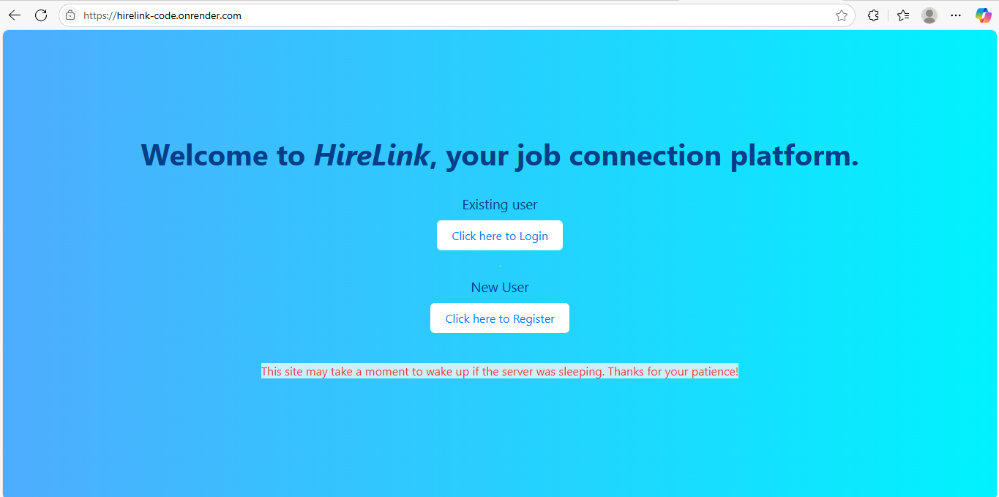
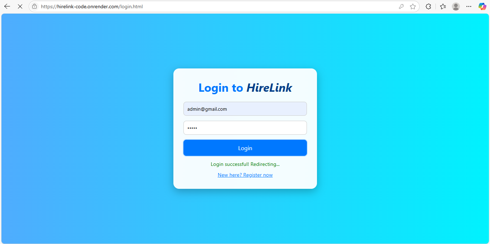
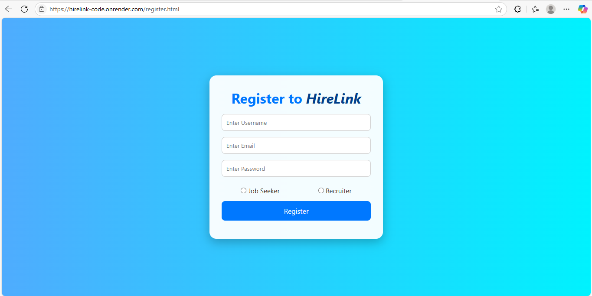
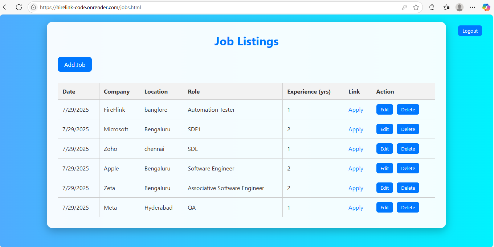
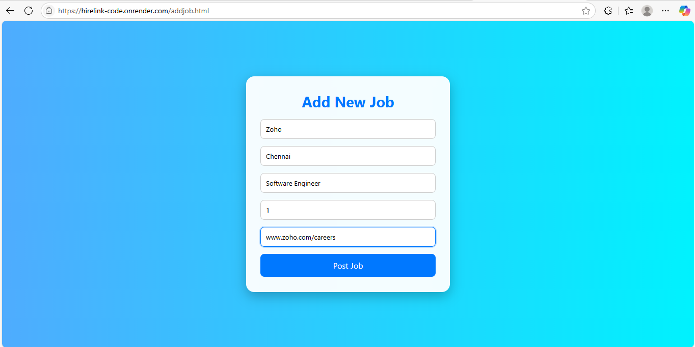
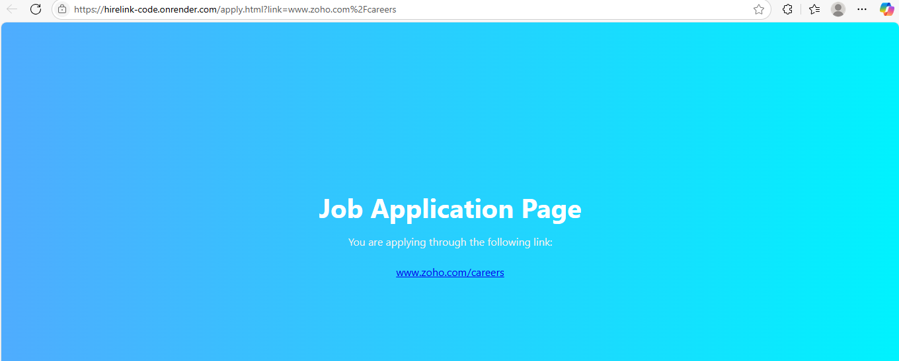

# HireLink

**HireLink** is a backend REST API service built with **Spring Boot** for handling user authentication, role management, and job posting functionalities.

---

## 🔗 Live Demo

Visit the live app: [https://hirelink-code.onrender.com](https://hirelink-code.onrender.com)


## 🛠 Tech Stack

- Java
- Spring Boot
- Spring Security
- JWT (JSON Web Token)
- Maven
- PostgreSQL (or any JPA-compatible DB)

---

## 🚀 Features

- 🔐 User Sign In/Sign Up with JWT Authentication
- 👥 Role-based Access Control (Admin/User)
- 📄 RESTful APIs for managing jobs and users
- 🗄️ JPA Repositories for database operations
- 🌐 CORS Configuration for frontend integration

---

## 📁 Project Structure

HireLink/

├── controller/

│ ├── AuthController.java

│ └── JobController.java

├── config/

│ ├── JwtFilter.java

│ ├── SecurityConfig.java

│ └── WebConfig.java

├── model/

│ ├── User.java

│ ├── Role.java

│ └── Job.java

├── repo/

│ ├── UserRepository.java

│ └── JobRepository.java

├── service/

│ ├── JwtService.java

│ └── CustomUserDetailsService.java

└── SignInPageApplication.java


---

## 📦 Setup & Run Locally

### 1. Clone the Repository

```bash
git clone https://github.com/mohamedshahban94/HireLink.git
cd HireLink
```
---

## 🔌 API Endpoints

🔐 Authentication
| Method | Endpoint    | Description                 |
| ------ | ----------- | --------------------------- |
| POST   | `/register` | Register a new user         |
| POST   | `/login`    | Login and receive JWT token |

💼 Job Management
| Method | Endpoint     | Description        |
| ------ | ------------ | ------------------ |
| GET    | `/jobs`      | Get all jobs       |
| GET    | `/jobs/{id}` | Get job by ID      |
| POST   | `/jobs`      | Create a new job   |
| PUT    | `/jobs/{id}` | Update job details |
| DELETE | `/jobs/{id}` | Delete a job by ID |

---

## 🔗 Live Demo

Visit the live app: [https://hirelink-code.onrender.com](https://hirelink-code.onrender.com)

## 📸 Screenshots

### 🔐  PageHome


### 🔐 Login Page


### 🔐 Register Page


### 📋 Job List Page


### 📝 Add Job


### 📝 Apply Link



